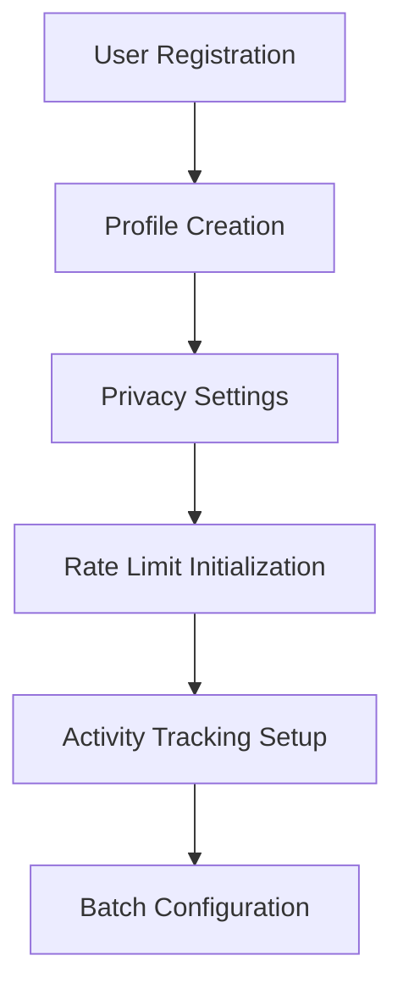
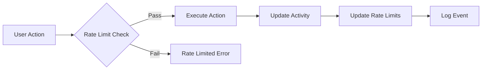
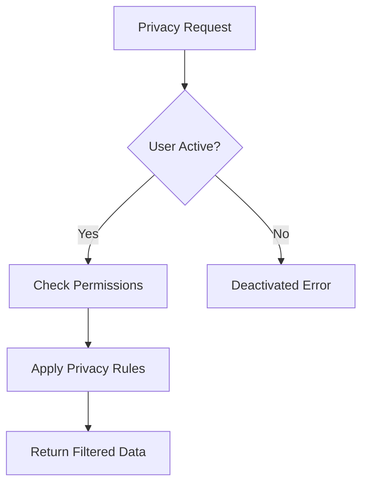

# BitSocial - Bitcoin-Native Social Protocol

A next-generation decentralized social network leveraging Bitcoin's security through Stacks Layer 2 infrastructure. BitSocial enables censorship-resistant social interactions with cryptographic privacy guarantees and Bitcoin-aligned economic incentives.

## 🚀 Core Innovation

- **Cryptographically Secure Social Graph**: User relationships and content distribution backed by Bitcoin's security model
- **Zero-Knowledge Privacy Controls**: Selective disclosure mechanisms with quantum-resistant encryption
- **Economic Spam Prevention**: Bitcoin-backed rate limiting with automatic adjustment algorithms
- **Intelligent Batch Processing**: Layer 2 optimized scalability with dynamic batch size optimization
- **Cross-Chain Compatibility**: Decentralized identity management with Bitcoin UTXO integration

## 📋 System Overview

BitSocial operates as a decentralized social protocol built on Stacks Layer 2, providing:

### Privacy-First Architecture

- **Granular Privacy Controls**: Users control visibility of friend lists, status updates, metadata, and profile information
- **Encryption-Enabled Profiles**: Optional end-to-end encryption for enhanced privacy
- **Selective Disclosure**: Users can choose what information to share with different social circles

### Advanced Rate Limiting

- **Multi-Tier Protection**: Daily action limits, friend request quotas, and status update restrictions
- **Automatic Reset Cycles**: 24-hour rate limit periods with intelligent adjustment algorithms
- **Economic Disincentives**: Bitcoin-backed penalties for spam and abuse prevention

### Intelligent Batch Processing

- **Dynamic Optimization**: Automatic batch size adjustment based on usage patterns
- **Expiry Management**: Time-based batch expiration with rollover protection
- **Scalability Focus**: Layer 2 optimized for high-throughput social interactions

## 🏗️ Contract Architecture

### Data Layer Structure

```
┌─────────────────────────────────────────────────────────────┐
│                     BitSocial Core Maps                     │
├─────────────────────────────────────────────────────────────┤
│  Users              │  Core user registry with profiles     │
│  UserPrivacy        │  Privacy control matrix               │
│  RateLimits         │  Rate limiting engine                 │
│  UserBatches        │  Batch processing optimizer           │
│  UserActivity       │  Activity tracking system             │
│  Friendships        │  Social relationship graph            │
│  BlockedUsers       │  Block management registry            │
└─────────────────────────────────────────────────────────────┘
```

### Core Components

#### 1. **User Management System**

- **Registration & Profiles**: Comprehensive user data with metadata support
- **Status Management**: Active, deactivated, and suspended user states
- **Privacy Controls**: Granular visibility settings for all user data

#### 2. **Social Graph Engine**

- **Friendship Management**: Pending, active, and blocked relationship states
- **Block System**: Comprehensive user blocking with timestamp tracking
- **Relationship Verification**: Cryptographic proof of social connections

#### 3. **Rate Limiting Framework**

- **Multi-Action Tracking**: Separate limits for different action types
- **Automatic Reset**: Time-based limit resets with period management
- **Dynamic Adjustment**: Intelligent rate limit optimization

#### 4. **Batch Processing Optimizer**

- **Size Optimization**: Dynamic batch size adjustment based on usage
- **Expiry Management**: Automatic batch expiration and cleanup
- **Performance Scaling**: Layer 2 optimized transaction batching

## 🔄 Data Flow Architecture

### User Registration & Profile Management



### Social Interaction Flow



### Privacy Control Matrix



## 🛠️ Key Functions

### Privacy Management

- `update-advanced-privacy-settings`: Comprehensive privacy configuration
- `get-privacy-settings`: Retrieve current privacy settings with defaults

### Profile Management

- `update-user-profile`: Update user profile with optional parameters
- `record-login`: Track user authentication and activity

### Batch Processing

- `optimize-batch-size`: Intelligent batch size optimization
- `set-batch-size`: Manual batch size configuration

### Rate Limiting

- `check-rate-limit`: Verify action permission against limits
- `update-rate-limit`: Update rate limit counters after actions

## 📊 Performance Features

### Scalability Optimizations

- **Layer 2 Integration**: Optimized for Stacks Layer 2 transaction costs
- **Batch Processing**: Intelligent batching reduces transaction overhead
- **State Optimization**: Efficient data structures minimize storage costs

### Security Measures

- **Multi-Layer Rate Limiting**: Prevents spam and abuse
- **Cryptographic Privacy**: End-to-end encryption support
- **Activity Monitoring**: Comprehensive audit trails

## 🔒 Security Model

### Rate Limiting Protection

- **Daily Action Limits**: 100 actions per user per day
- **Friend Request Quotas**: 20 friend requests per day
- **Status Update Limits**: 24 status updates per day

### Privacy Guarantees

- **Selective Disclosure**: Users control information visibility
- **Encryption Support**: Optional end-to-end encryption
- **Access Control**: Granular permission management

### Activity Monitoring

- **Comprehensive Tracking**: Login counts, action timestamps, activity patterns
- **Fraud Prevention**: Unusual activity detection and reporting
- **Audit Trails**: Complete activity logging for security analysis

## 🚀 Getting Started

### Prerequisites

- Stacks blockchain node or connection
- Clarity development environment
- Bitcoin testnet/mainnet access

### Deployment

1. Deploy the BitSocial contract to Stacks Layer 2
2. Initialize system constants and configurations
3. Set up rate limiting parameters
4. Configure privacy defaults

### Integration

- Use the public functions to interact with the social protocol
- Implement frontend applications using the provided APIs
- Integrate with Bitcoin wallet infrastructure

## 📈 Future Roadmap

- **Cross-Chain Integration**: Expand to other Bitcoin Layer 2 solutions
- **Advanced Cryptography**: Implement zero-knowledge proofs
- **Economic Incentives**: Token-based social reputation systems
- **Mobile SDK**: Native mobile application support
- **Developer Tools**: Enhanced debugging and monitoring capabilities

## 🤝 Contributing

BitSocial is built for the Bitcoin and Stacks communities. Contributions are welcome for:

- Security audits and improvements
- Performance optimizations
- Feature enhancements
- Documentation improvements

## 📄 License

This project is licensed under the MIT License - see the LICENSE file for details.
